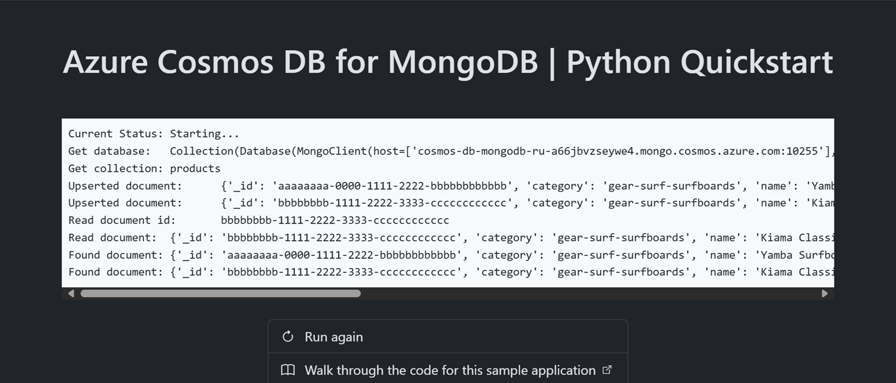

<!--
---
page_type: sample
name: "Quickstart: Azure Cosmos DB for MongoDB and Azure SDK for Python"
description: This is a simple Express  web application to illustrate common basic usage of Azure Cosmos DB for MongoDB and the Azure SDK for Python.
urlFragment: template
languages:
- typescript
- javascript
- azdeveloper
products:
- azure-cosmos-db
---
-->

# Quickstart: Azure Cosmos DB for MongoDB - Azure SDK for Python

This is a simple Express web application to illustrate common basic usage of Azure Cosmos DB for MongoDB with the Azure SDK for Python

## Prerequisites

- [Docker](https://www.docker.com/)
- [Azure Developer CLI](https://aka.ms/azd-install)
- [Python 3.12](https://www.python.org/downloads/)

## Quickstart

1. Log in to Azure Developer CLI. *This is only required once per-install.*

    ```bash
    azd auth login
    ```

1. Initialize this template (`cosmos-db-mongodb-python-quickstart`) using `azd init`.

    ```bash
    azd init --template cosmos-db-mongodb-python-quickstart
    ```

1. (Optional) Select either `vcore` or `request-unit` account type using `azd env set`.

    ```bash
    azd env set "MONGODB_DEPLOYMENT_TYPE" "vcore"
    ```

    ```bash
    azd env set "MONGODB_DEPLOYMENT_TYPE" "request-unit"
    ```

1. Ensure that **Docker** is running in your environment.

1. Use `azd up` to provision your Azure infrastructure and deploy the web application to Azure.

    ```bash
    azd up
    ```

1. Observed the deployed web application

    
